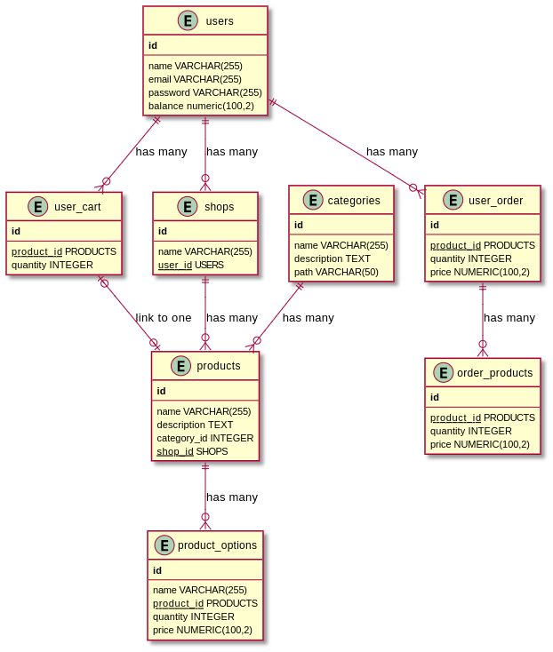

# Go project with Gin, Cobra, Fx, Gorm

1. API server
   - Gin for Routing, DTO validation
2. Command-line
   - Cobra for creating command-line
   - `api:launch`
   - to be added
3. Dependencies Injection
   - Uber's FX
4. GORM
   - GORM with postgres
   - database migration with `sql-migrate`
5. Others
   - Swagger
   - Docker
   - K6 (load testing)
   - gotest (unit testing)

# Architecture Design

1. Database
   
2. System
3. Example flow
